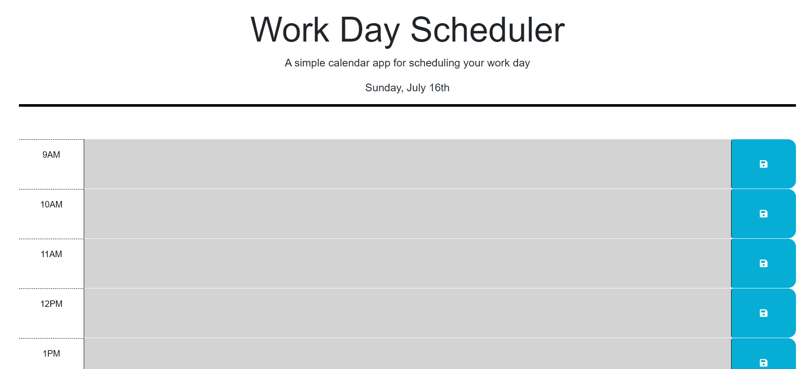
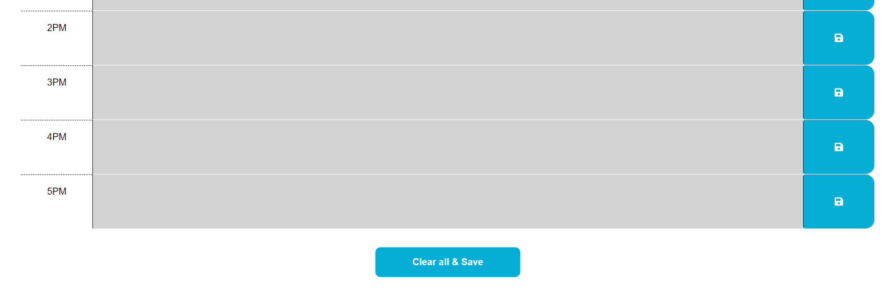

# <Password Generator>

## Description

As a working individual, it is crucial to have a well-organized plan that outlines specific tasks and their deadlines. One effective method for achieving this is by using a scheduler that allows you to efficiently manage your time and tasks.

As an aspiring web developer, I have created a work schedule website by building upon an existing foundation. This website offers users the convenience of plotting their plans in nine separate tabs, each representing one hour of the typical 9-5 workday. Additionally, users can save the entered text on the page, ensuring that their plans are saved when they return to the site.

One of the unique features of this scheduler is its ability to visually represent time through color in the hour tabs. These indicators help users identify approaching deadlines (in red) and distinguish between past (grey) and future plans (green). By providing a responsive and user-friendly interface, my application assists individuals in effectively managing their daily tasks and creating a well-structured schedule for their workday.

## Installation

N/A

## Usage

Upon visiting the website, users find by a header followed by the main content area. The header provides a brief description and a title, accompanied by a dynamically updating display of the current day. As the user scrolls down, they encounter nine tabs representing each hour of a typical 9-5 workday. These tabs enable users to enter their plans or comments, which can be saved using the button located on the right side of each tab. Upon reloading the website, the saved text remains in the respective tabs.

The hour tabs utilize the dayjs() library to conditionally check the present hour of the day. Based on the comparison, the tabs are color-coded for better visual understanding. If a tab corresponds to a past hour, it appears grey. If a tab represents the current hour, it appears in red. And if a tab represents to a future hour, it is displayed in green. This color scheme helps users scale how much time they have left to start or complete the tasks they have written in each tab.

At the bottom of the page, for added convenience, a Clear & Save All button is provided. This button allows users to clear all the tabs in their schedule, while also saving their current content for future reference. This assists in keeping the interface tidy, without having to manually go through each tab to delete everything.

## Credits

N/A

## License

Refer to the LICENSE in the repo (MIT).

## Features

Current day displayed at the top of the calender.
Presented with time blocks for standard business hours from 9am-5pm.
Each block is color coded to indicate whether it's in the past, present, or future.
You can enter an event in the time blocks.
Text is saved in localstorage whenever a save button is clicked.
Upon refresh, saved events persist.
Additional clear & save all functionality at the bottom of the page.
Ease of access.
Functional.
Simple design.

## Images

## Link

GitHub:https://github.com/jujusoi/JM-Work-Scheduler

GitHub Pages: https://jujusoi.github.io/JM-Work-Scheduler
